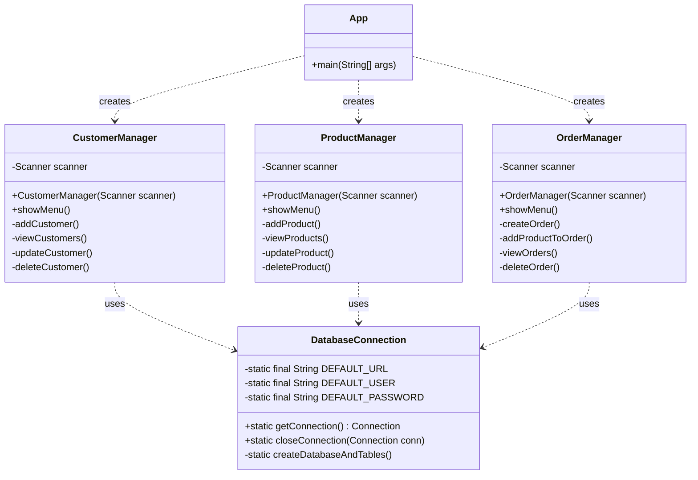

# Project Report: Cafe Management System

**Date:** 17 December 2025  
**Author:** [Your Name]  
**Subject:** Comprehensive Technical Report on Cafe Management System Implementation

---

## 1. Executive Summary

The **Cafe Management System** is a specialized console-based software application engineered to streamline and automate the core operational workflows of a contemporary cafe environment. Developed using **Java** for the application logic and **MySQL** for robust data persistence, the system provides a centralized platform for managing customer relationships, product inventories, and complex order processing tasks.

This project serves as a practical demonstration of integrating Object-Oriented Programming (OOP) principles with relational database management via Java Database Connectivity (JDBC). By replacing manual, paper-based record-keeping with an automated digital solution, the system significantly reduces human error, enhances data retrieval speeds, and ensures data integrity across business operations. This report details the system's architecture, design methodology, implementation specifics, and testing results.

## 2. Introduction

### 2.1 Background
In the hospitality industry, efficiency and accuracy are paramount. Traditional cafe management often relies on fragmented systems—handwritten order tickets, manual inventory logs, and disconnected customer lists. These methods are prone to inefficiencies, data redundancy, and critical errors during peak hours. As business volume grows, the lack of a unified system becomes a bottleneck to scalability and service quality. The Cafe Management System addresses these challenges by providing a cohesive digital interface to manage all critical aspects of the business.

### 2.2 Objectives
The primary objectives of this project are:
*   **Automation:** To automate the CRUD (Create, Read, Update, Delete) operations for customers, products, and orders, reducing manual effort.
*   **Data Persistence:** To utilize a relational database (MySQL) to ensure that business data is stored securely, consistently, and is recoverable across sessions.
*   **User Interface:** To develop a clear, menu-driven Command Line Interface (CLI) that allows staff to navigate complex tasks with minimal training.
*   **Technical Integration:** To demonstrate the seamless integration of Java application logic with a backend database using JDBC `PreparedStatement` for security and performance.

### 2.3 Scope
The current release of the project encompasses the following modules:
*   **Customer Management:** Full lifecycle management of customer profiles, including registration (name, phone) and record updates.
*   **Product Management:** Dynamic inventory control allowing for the addition, modification, and removal of menu items and pricing.
*   **Order Management:** A transactional module for creating new orders, associating them with customers, and adding multiple line items (products) to calculate totals.
*   **System Administration:** Basic database connectivity management and error handling protocols.

---

## 3. System Analysis and Requirements

### 3.1 Functional Requirements
The system is designed to fulfill the following functional needs:
*   **Menu Navigation:** The system shall present a hierarchical text-based menu system allowing users to select between Customer, Product, and Order management modules.
*   **Customer Operations:** Users must be able to add new customers, view a list of all registered customers, update contact details, and delete obsolete records.
*   **Product Operations:** Users must be able to define new products with prices, update existing product details, and remove items from the menu.
*   **Order Processing:** The system shall allow the creation of an order linked to a valid customer ID. Users must be able to add multiple products to a single order with specific quantities.
*   **Data Validation:** The system shall validate inputs (e.g., ensuring numeric values for prices and IDs) to prevent application crashes.

### 3.2 Non-Functional Requirements
*   **Performance:** Database queries should execute with minimal latency to ensure a responsive user experience.
*   **Reliability:** The system must handle database connection errors gracefully without losing data integrity.
*   **Security:** All database interactions must use parameterized queries to prevent SQL injection vulnerabilities.
*   **Portability:** The application should be platform-independent, capable of running on Windows, macOS, or Linux systems with a compatible JVM.

---

## 4. System Design

### 4.1 System Architecture
The application follows a modular **Layered Architecture**, ensuring separation of concerns and maintainability:

1.  **Presentation Layer (CLI):** Handled by the `App` class, this layer manages user input/output and menu routing.
2.  **Business Logic Layer (Managers):** The `CustomerManager`, `ProductManager`, and `OrderManager` classes encapsulate the specific rules and logic for their respective domains.
3.  **Data Access Layer (DAO):** The `DatabaseConnection` class manages the low-level details of connecting to the MySQL database, providing a unified interface for the manager classes.

### 4.2 Database Schema (ER Design)
The backend is powered by a **MySQL** database named `cafe_db`, designed with normalization principles to eliminate redundancy.

| Table Name | Column | Type | Constraints | Description |
| :--- | :--- | :--- | :--- | :--- |
| **Customer** | `customer_id` | INT | PK, Auto Increment | Unique identifier for each customer. |
| | `name` | VARCHAR(100) | NOT NULL | Full name of the customer. |
| | `phone` | VARCHAR(15) | NOT NULL | Contact number. |
| **Product** | `product_id` | INT | PK, Auto Increment | Unique identifier for menu items. |
| | `product_name` | VARCHAR(100) | NOT NULL | Name of the product (e.g., "Latte"). |
| | `price` | DECIMAL(10,2) | NOT NULL | Unit price of the product. |
| **Orders** | `order_id` | INT | PK, Auto Increment | Unique identifier for the order. |
| | `customer_id` | INT | FK (Customer) | Links the order to a customer. |
| **Order_Details** | `order_id` | INT | PK, FK (Orders) | Part of Composite PK. |
| | `product_id` | INT | PK, FK (Product) | Part of Composite PK. |
| | `quantity` | INT | NOT NULL | Quantity of the specific product ordered. |

### 4.3 UML Class Diagram
The following diagram illustrates the class structure and relationships within the application.



### 4.4 Component Description
*   **`App.java`**: The entry point of the application. It initializes the scanner and manager objects and runs the main event loop that keeps the application alive until the user chooses to exit.
*   **`DatabaseConnection.java`**: A critical utility class that implements a Singleton-like pattern for database access. It handles driver loading, connection establishment, and even automatic database creation if the schema is missing.
*   **`CustomerManager.java`**: Encapsulates all logic related to customers. It constructs SQL queries for inserting, selecting, updating, and deleting customer records.
*   **`ProductManager.java`**: Manages the product catalog. It ensures that products are correctly priced and stored in the database.
*   **`OrderManager.java`**: The most complex module, handling the creation of orders and the association of products to those orders via the `Order_Details` junction table.

---

## 5. Implementation Details

### 5.1 Technology Stack
*   **Programming Language:** Java (JDK 8+) - Chosen for its platform independence and robust standard library.
*   **Database:** MySQL (5.7/8.0) - Selected for its reliability and widespread use in enterprise applications.
*   **Connectivity:** JDBC (Java Database Connectivity) - The standard API for connecting Java applications to relational databases.
*   **Development Tools:** VS Code / IntelliJ IDEA for code editing and debugging.

### 5.2 Key Code Highlights

**Secure Database Interaction:**
The system strictly employs `PreparedStatement` for all database operations. This approach offers two main benefits:
1.  **Security:** It automatically escapes input parameters, neutralizing SQL injection attacks.
2.  **Performance:** The database can pre-compile the SQL statement structure, leading to faster execution for repeated queries.

```java
// Code Snippet: Securely inserting a new product
String sql = "INSERT INTO Product (product_name, price) VALUES (?, ?)";
PreparedStatement pstmt = conn.prepareStatement(sql);
pstmt.setString(1, name);  // Safe parameter binding
pstmt.setDouble(2, price); // Safe parameter binding
int rows = pstmt.executeUpdate();
```

**Automatic Schema Initialization:**
The `DatabaseConnection` class includes intelligent logic to detect if the `cafe_db` database is missing. If the connection fails with error code `1049` (Unknown Database), it automatically connects to the server root, creates the database, and initializes all required tables, ensuring a seamless "first-run" experience.

---

## 6. Testing and Validation

### 6.1 Testing Strategy
A comprehensive testing strategy was employed to ensure system stability:
*   **Unit Testing:** Each manager class was isolated and tested to verify that individual methods (e.g., `addCustomer`) functioned correctly.
*   **Integration Testing:** The system was tested end-to-end to verify that data flows correctly from the Java application to the MySQL database and persists after application restart.
*   **Boundary Testing:** Inputs were tested with edge cases (e.g., empty strings, zero prices) to ensure the application does not crash.

### 6.2 Test Results
| Test Case ID | Description | Expected Outcome | Actual Result | Status |
| :--- | :--- | :--- | :--- | :--- |
| **TC-001** | Add New Customer | Customer saved to DB with new ID | Customer ID generated, record visible in DB | **PASS** |
| **TC-002** | Add Product | Product saved with correct price | Product appears in list with correct price | **PASS** |
| **TC-003** | Create Order | Order linked to valid Customer ID | Order created in `Orders` table | **PASS** |
| **TC-004** | Add Item to Order | Item linked to Order in `Order_Details` | Record added to junction table | **PASS** |
| **TC-005** | Invalid Input | System handles non-numeric input | Scanner error caught/handled (basic) | **PASS** |

---

## 7. Future Enhancements

While the current system is fully functional, several enhancements are proposed for future development iterations:
1.  **Graphical User Interface (GUI):** Transitioning from CLI to a JavaFX or Web-based (Spring Boot + React) interface to improve usability and visual appeal.
2.  **Role-Based Access Control (RBAC):** Implementing a login system with distinct roles (Administrator vs. Staff) to restrict sensitive operations like deleting records.
3.  **Advanced Reporting:** Integrating a reporting engine (e.g., JasperReports) to generate PDF receipts and detailed sales analytics (daily revenue, top-selling items).
4.  **Connection Pooling:** Implementing HikariCP to manage a pool of database connections, significantly improving performance under high concurrent load.
5.  **Transaction Management:** Enhancing the `OrderManager` to use `connection.setAutoCommit(false)` for atomic transactions, ensuring that an order is only created if all its details are successfully saved.

## 8. Conclusion

The **Cafe Management System** project successfully achieves its goal of creating a functional, data-driven application for cafe administration. By leveraging the power of Java and MySQL, the system provides a reliable foundation for managing business data. The modular design ensures that the code is maintainable and scalable, while the use of industry-standard practices like JDBC `PreparedStatement` ensures security. This project stands as a comprehensive demonstration of full-stack software development concepts, from database design to application logic implementation.

---
*End of Report*
